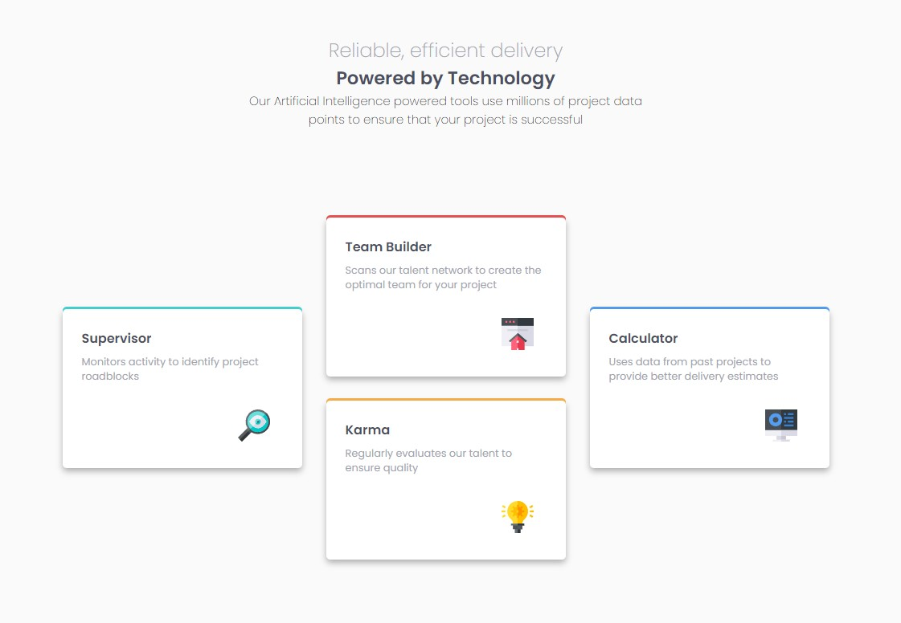

# Frontend Mentor - Four card feature section solution

This is a solution to the [Four card feature section challenge on Frontend Mentor](https://www.frontendmentor.io/challenges/four-card-feature-section-weK1eFYK). Frontend Mentor challenges help you improve your coding skills by building realistic projects.

## Table of contents

- [Overview](#overview)
  - [The challenge](#the-challenge)
  - [Screenshot](#screenshot)
  - [Links](#links)
- [My process](#my-process)
  - [Built with](#built-with)
  - [What I learned](#what-i-learned)
- [Author](#author)

## Overview

### The challenge

Users should be able to:

- View the optimal layout for the site depending on their device's screen size

### Screenshot

### Links

- Solution URL: [Code in Github](https://github.com/Jani-B/FEM-four-card-feature-nextjs)
- Live Site URL: [Live site in Netlify](https://janifourdcards.netlify.app/)

## My process

### Built with

- Semantic HTML5 markup
- CSS custom properties
- Flexbox
- CSS Grid
- Mobile-first workflow
- [Next.js](https://nextjs.org/) - React framework

### What I learned

Learned to use Next.js for small project. I used object from file cardinfo to create a map that will go trough all items in the file and add them to the card component.

## Author

- Frontend Mentor - [@Jani-B](https://www.frontendmentor.io/profile/Jani-B)
